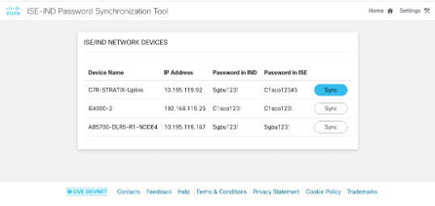

# GVE DevNet ISE-IND Password Synchornization
This prototype allows its user to (1) retrieve network device passwords from Cisco ISE, (2) retrieve corresponding (based on IP address) devices and their passwords from Cisco IND, and (3) synchronize the IND to ISE passwords. 

## Contacts
* Stien Vanderhallen

## High Level Overview


## Solution Components
*  Cisco Industrial Network Director (IND)
*  Cisco Identity Services Engine (ISE)

## Installation/Configuration

0. In your terminal, clone this repository

```
$ git clone https://wwwin-github.cisco.com/stienvan/ind_ise_password_sync.git
$ cd ind_ise_password_sync
```

1. In `.env`, enter your ISE and IND credentials.

2. Install the required Python libraries

```
$ pip install -r requirements.txt
```

3. Start the application

```
$ python3 app.py
```

4. In a browser, navigate to `localhost:5555`


5. Select the password you want to synchronize


6. Verify the password update



7. **NOTE:** `ise_dummy.json`, `ind_dummy.json`, and `profile_dummy.json` contain example data of respectively ISE network devices, IND network devices, and an IND access profile.

### LICENSE

Provided under Cisco Sample Code License, for details see [LICENSE](LICENSE.md)

### CODE_OF_CONDUCT

Our code of conduct is available [here](CODE_OF_CONDUCT.md)

### CONTRIBUTING

See our contributing guidelines [here](CONTRIBUTING.md)

#### DISCLAIMER:
<b>Please note:</b> This script is meant for demo purposes only. All tools/ scripts in this repo are released for use "AS IS" without any warranties of any kind, including, but not limited to their installation, use, or performance. Any use of these scripts and tools is at your own risk. There is no guarantee that they have been through thorough testing in a comparable environment and we are not responsible for any damage or data loss incurred with their use.
You are responsible for reviewing and testing any scripts you run thoroughly before use in any non-testing environment.
